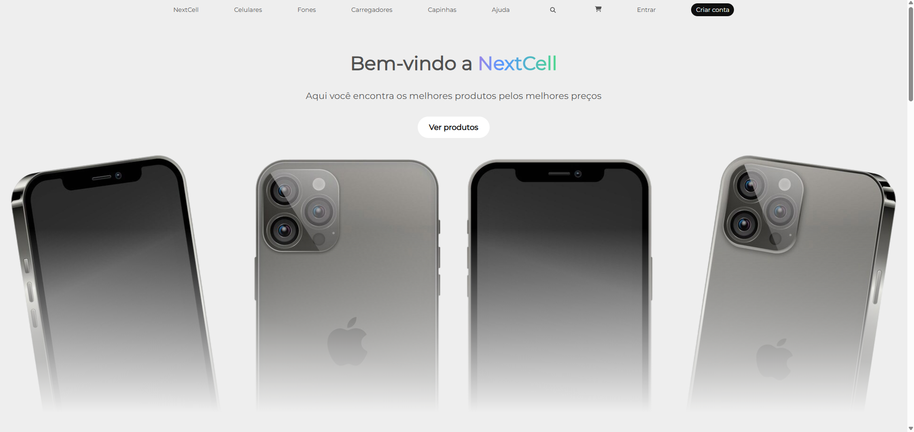

📱 NextCell

**NextCell** is a fictional mobile store website created for portfolio purposes. The project was built using **HTML, CSS, and vanilla JavaScript**, focusing on a clean, responsive layout and smooth user experience.

## 🖼️ Preview



## ✨ Features

- Responsive landing page
- Hero section with animation
- Featured product highlights
- About section describing the store
- Services section (e.g. phone repair, screen replacement, screen protector swap)
- Testimonial carousel with infinite looping
- Modern interface with subtle animations

## 📁 Project Structure

```
assets/
├── css/
│   ├── fonts.css
│   └── style.css
├── fonts/
├── images/
│   ├── icons/
│   ├── cliente_1.jpg ... cliente_4.jpg
│   └── iphone16.jpg, reparo.jpg, etc.
├── javascript/
│   └── app.js
index.html
```

## 🚀 Getting Started

1. Clone the repository:
   ```bash
   git clone https://github.com/your-username/nextcell.git
   ```
2. Open the `index.html` file in your browser  
   or  
   Use **Live Server** in VS Code for a local preview.

## 🛠 Built With

- HTML5
- CSS3
- JavaScript (Vanilla)

## 📌 Disclaimer

This website is **not real** and was created **solely for educational and portfolio purposes**. The products and testimonials are fictitious.
